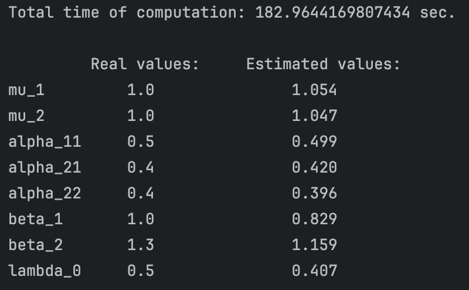

# Spectral estimation for Noisy Hawkes processes

Source code for [Spectral analysis for noisy Hawkes processes inference](https://hal.science/hal-04580719) [[1]](#1).  
Code pre-revision (before 1st February 2025) is now in branch [pre_revision_v1](https://github.com/migmtz/noisy-hawkes-process/tree/pre_revision_v1).

This code implements parametric estimation of Hawkes process when noised by an independent, homogeneous Poisson process.
Data is assumed to be the superposition of these two point processes, which corresponds to the ordered union of event times. We assume that both processes are indistinguishable, in other words, there is no way of knowing whether a point comes from the Hawkes process or the Poisson process.

This leverages spectral analysis of point processes and what is known as the Bartlett spectrum. The Bartlett spectrum of the superposition of two independent processes corresponds to the sum of respective spectra.

Estimations are obtained by maximisation of a spectral equivalent of the log-likelihood (in this code, we implement the minimisation of the opposite quantity through the minimize method of Scipy).

## Functions in ```spectral_functions.py```
The functions ```spectral_log_likelihood``` and ```spectral_log_likelihood_grad``` are implemented as general expressions dependent on a function (parameter f) which computes the spectral density of a point process. 

The ```periodogram``` is a quantity that can be precomputed in order to accelerate the estimation, as this quantity is not dependent on the type of point processes.  
The [finufft](https://finufft.readthedocs.io/en/latest/index.html) package is used to efficiently compute this peridogram.
All implementation of the spectral log-likelihood take directly the periodogram as a parameter.

The implemented spectral density functions correspond to the exponential kernel function $h(t) = \alpha \beta \exp^{-\beta t}$ for $t>0$.

## Example

We include two examples of application:
* ```univariate_noisy_estimation.py``` for an estimation in the univariate setting, which requires fixing one parameter to assure identifiability of the model.
* ```bivariate_noisy_estimation.py``` for an estimation in the bivariate setting.(Proven) Identifiable settings assume that certain interactions are null. Function
```spectral_multivariate_noised_ll``` can be used to estimate the null interactions before implementing one of the identifiable cases (specially when many realisations are available).

The image below shows the results of ```bivariate_noisy_estimation.py```:




## Dependencies

Code stable for Python 3.13.1.  
See ```requirements.txt``` for dependencies.

## Installation

Copy all files in the current working directory.  
Create working environment via ```requirements.txt```.

## Author

Miguel Alejandro Martinez Herrera

## References

<a id="1">[1]</a>
A. Bonnet, F. Cheysson, M. Martinez Herrera, M. Sangnier, Spectral analysis for noisy Hawkes processes inference. Hal: [⟨hal-04580719⟩](https://hal.science/hal-04580719) 2024.
